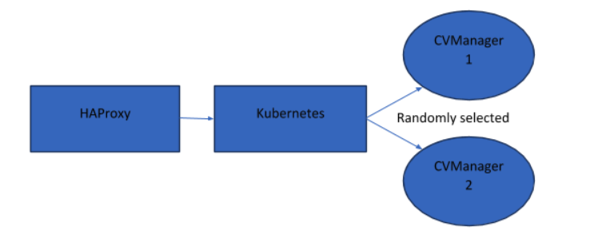
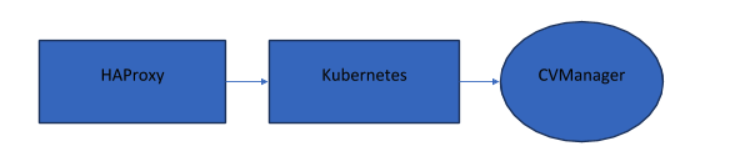
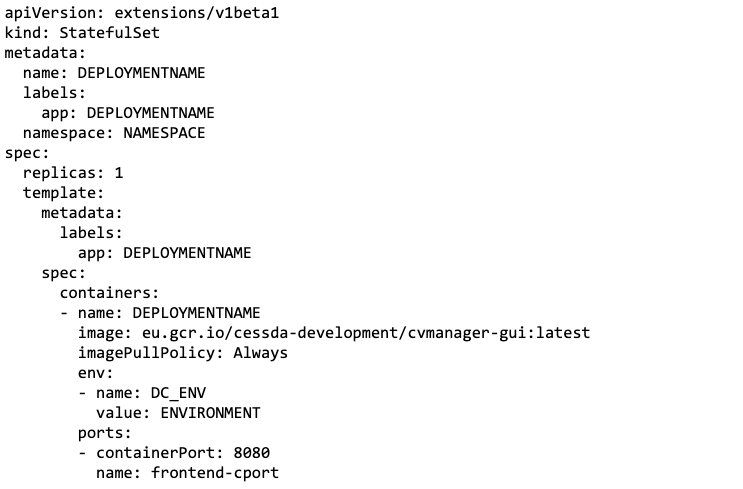
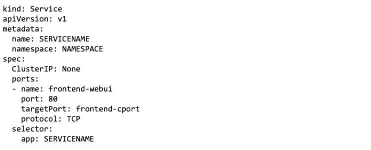

[](https://jenkins.cessda.eu/job/cessda.cvs.gui/job/master/)
[](https://sonarqube.cessda.eu/dashboard?id=eu.cessda.cvmanager%3Acvmanager-gui)
[](https://sonarqube.cessda.eu/dashboard?id=eu.cessda.cvmanager%3Acvmanager-gui)
[](https://sonarqube.cessda.eu/dashboard?id=eu.cessda.cvmanager%3Acvmanager-gui)
[](https://sonarqube.cessda.eu/dashboard?id=eu.cessda.cvmanager%3Acvmanager-gui)
[](https://sonarqube.cessda.eu/dashboard?id=eu.cessda.cvmanager%3Acvmanager-gui)
[](https://sonarqube.cessda.eu/dashboard?id=eu.cessda.cvmanager%3Acvmanager-gui)
[](https://sonarqube.cessda.eu/dashboard?id=eu.cessda.cvmanager%3Acvmanager-gui)
[](https://sonarqube.cessda.eu/dashboard?id=eu.cessda.cvmanager%3Acvmanager-gui)
[](https://sonarqube.cessda.eu/dashboard?id=eu.cessda.cvmanager%3Acvmanager-gui)
[](https://sonarqube.cessda.eu/dashboard?id=eu.cessda.cvmanager%3Acvmanager-gui)
[](https://sonarqube.cessda.eu/dashboard?id=eu.cessda.cvmanager%3Acvmanager-gui)
# CESSDA Vocabulary Service

This repository contains all the source code and configuration needed to deploy the CESSDA Vocabulary Service application

## Project Structure

```bash
<ROOT>
├── infrastructure/		# Deployment scripts and configuration for gcp
├── src/				# Java application source code and configuration
├── target/				# Target build location - this is not committed to Git
├── CONTRIBUTORS.md		# List of contributors to the project
├── Jenkinsfile			# Script used by Jenkins to deploy the application to gcp
├── pom.xml				# Maven build configuration file
├── README.md			# Instructions to build and deploy the application (this file)

```

## Technology Stack

Several frameworks and languages are used in this application.

| Framework/Technology                                 | Description                                              |
| ---------------------------------------------------- | -------------------------------------------------------- |
| Docker                                               | Container platform                                       |
| Kubernetes                                           | Container orchestrator                                   |
| Maven                                                | Build tool                                               |
| Java                                                 | Programming language and API                             |
| Vaadim                                               | Web application framework                                |
| Spring                                               | Web application framework                                |

## Getting Started

These instructions will get you a copy of the project up and running on your local machine for development and testing purposes. See the deployment section for instructions on how to deploy the project on a live system.

### Prerequisites

These are a list of dependencies that are required to build and run the CESSDA Vocabulary Service:

* Java to run the application
* Maven to build the application
* Docker to store the application in containers for deployment
* Google Cloud SDK and permissions to access CESSDA cloud platform

### Installing

To create a local dev environment follow these instructions:

1. Clone the repository to your local workspace
2. Ensure that any required software and dependencies are installed
3. Build the CESSDA Vocabulary Service with `mvn clean install docker:build -Pdocker-compose` (optional - use -DskipTests to speed up build)
4. Use `docker-compose up` in the directory `target/docker/generated` to start the application

The CESSDA Vocabulary Service should be running on `http://localhost:8080/`.

## Deployment

Deployment in the live Google Cloud Environment requires a couple of considerations:

1. All deployments to the GCP Kubernetes engine are done via Jenkins
2. The configuration for the deployment is stored in <https://bitbucket.org/cessda/cessda.cvs.deploy/>
3. Do not increase the replicas of the application. Because Vaadim keeps track of the session in the server increasing replicas will cause sessions to expire immediately, breaking the application.

Deployments should occur automatically once commits are made to this repository, if not go to <https://jenkins.cessda.eu/job/cessda.cvs.gui/> and select the appropriate branch to build.

## Session Timeout Issue

### Problem

When attempting to access the CVManager application, about a second after the page loads a banner appeared at the top of the web page with the message:

`Session Expired: Save your work and press ESC to refresh`

From this point onwards, the interface for the web application stops responding to all user input, rendering the site unusable.

### Cause

CVManager runs on a web platform called Vaadim, which is split into two separate components. The client is loaded into the User’s web browser and is responsible for creating the interface and communicating with the server. The server is responsible for keeping track of user sessions, getting data to and from databases and performing authentication for users.

The key thing of note here is that, unusually for a web server, the Vaadim server is stateful. This means when multiple instances of the application server are running for load balancing purposes the load balancer must be aware of which client is connected to each individual server and make sure that it is always the same server.



The issue was caused because Kubernetes was not aware of sessions and there were two replicas of the CVManager application running. Kubernetes randomly redirected from one server to another on each request. Normally this is not an issue as most web servers are stateless, but in this case it caused Vaadim to drop the sessions if the request was directed to a different server than where it originated.

### Fix

The number of replicas of the CVManager application was reduced from 2 to 1. This means the session will always be directed to the same server as only one exists. However, this fix does reduce the scalability of the application.



To have multiple instances of the CVManager server running, headless services should be used and the DNS names of the pods directly inserted into the HAProxy configuration. HAProxy is aware of HTTP sessions and should redirect the appropriate requests to the correct servers, preventing this session expiration issue.

## Implementing Stateful Sets

In order to expose each pod individually to the reverse proxy a Stateful set is needed in Kubernetes. Pods are exposed in stateful sets like this:

`$(statefulset name)-$(number).$(namespace).svc.cluster.local`

These DNS names need to be inserted into the HAProxy configuration. This allows multiple replicas whilst fixing the session expired message.
Stateful sets are defined like deployments. An example is shown below:



Stateful sets are exposed via headless services:



Given that HAProxy is aware of HTTP sessions it should continue redirecting clients to the correct server keeping sessions intact.

More information about stateful sets can be found at <https://kubernetes.io/docs/concepts/workloads/controllers/statefulset>.

## Persistent Backends

One of the issues with the CVManager application was that the SQL database and the Elasticsearch index was not persistent. This meant that when new versions of the application were built, or if the containing pods were recycled, all data (including users and other indexes used to run the application) was erased.

This was resolved by adding persistent volumes to the deployment scripts (called `cessda-cvmanager-storage-$ENV-pvc for the SQL server and cessda-cvmanager-es-$ENV-pvc` for Elasticsearch). These storage locations allow the database and the search index to persist past individual pod lifespans.

## Security and Exposed Components

When work was started on the CVManager application it was noted that a large amount of the components that make up the application were exposed to the internet via Kubernetes load balancers. This increases risk of application compromise and denial of service attacks.

To increase application security all application components were modified to be Kubernetes ClusterIPs. This ensures that the components can only be accessed by anything sharing the same Kubernetes cluster.

To ensure that new databases can still be remotely loaded in this configuration, Jenkins jobs were added to backup and restore the SQL database. These are called `cessda.cvmanager.dev.$ENV.backup and cessda.cvmanager.$ENV.sql.restore`.

As well as isolating components of the application passwords to access components were modified to be stored as Kubernetes secrets when possible. This allows passwords to be changed in one place and propagate to all appropriate components.

## Built With

* [Maven](https://maven.apache.org/) - Dependency Management

## Contributing

Please read [CESSDA Technical Guidelines](https://bitbucket.org/cessda/cessda.guidelines.public/) for details on our code of conduct, and the process for submitting pull requests to us.

## Authors

* **Julien Le Hericy** - *Initial automation and infrastructure*
* **Matthew Morris** - *Conversion to the new GCP infrastructure*

You can find the list of all contributors [here](CONTRIBUTORS.md).
